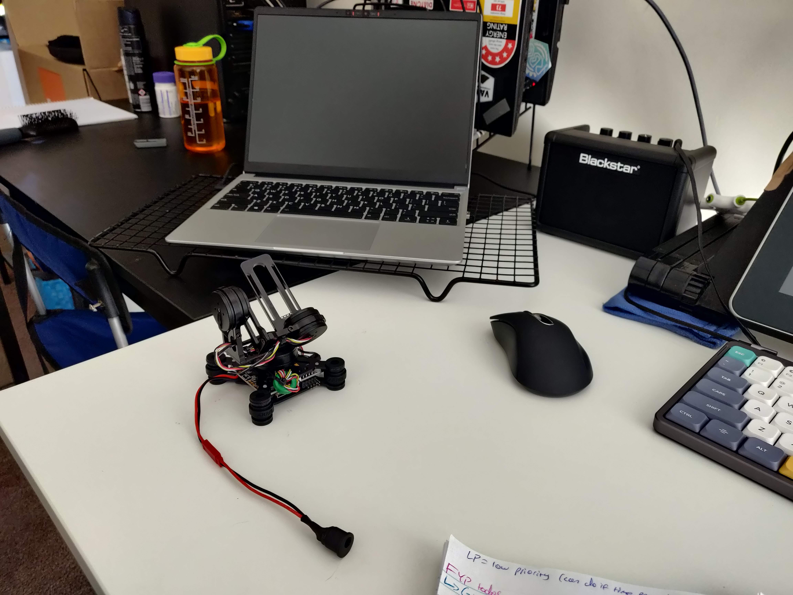
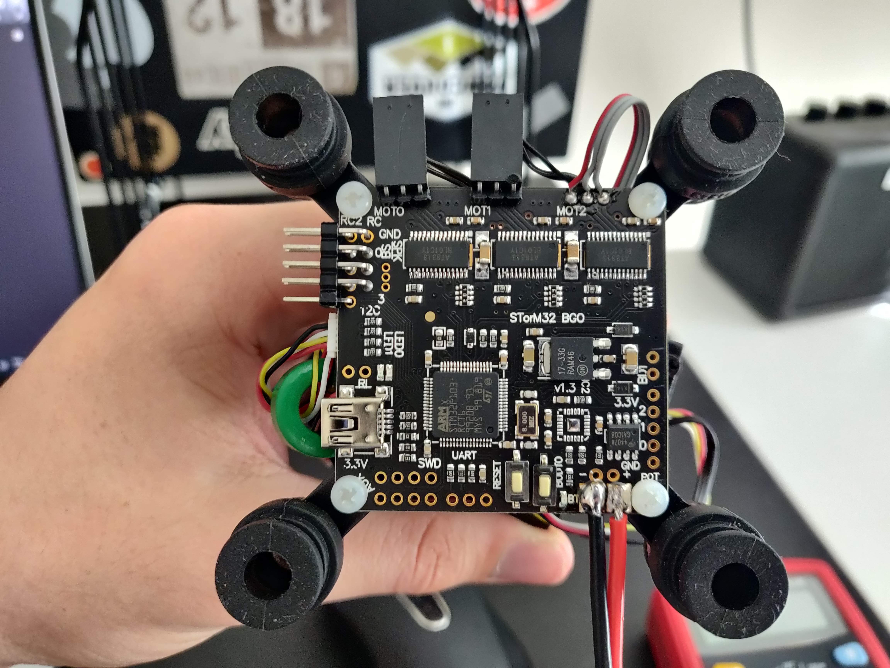
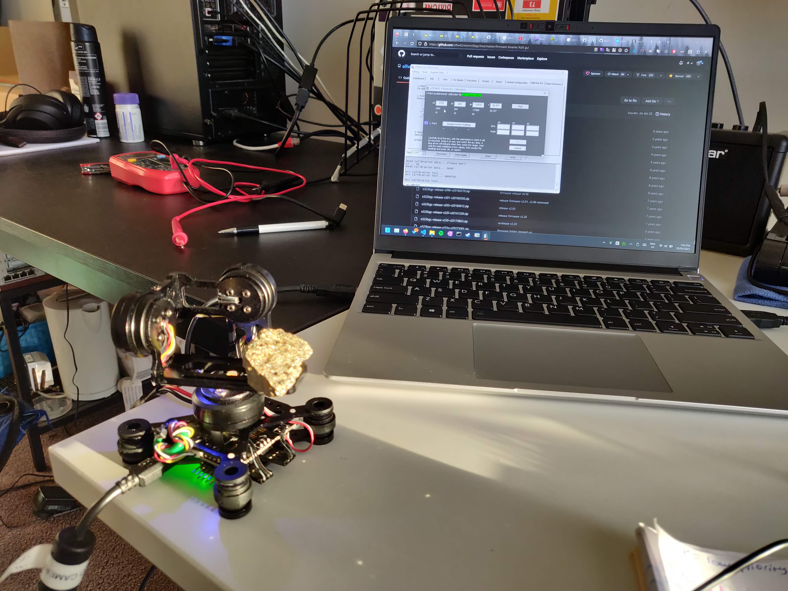
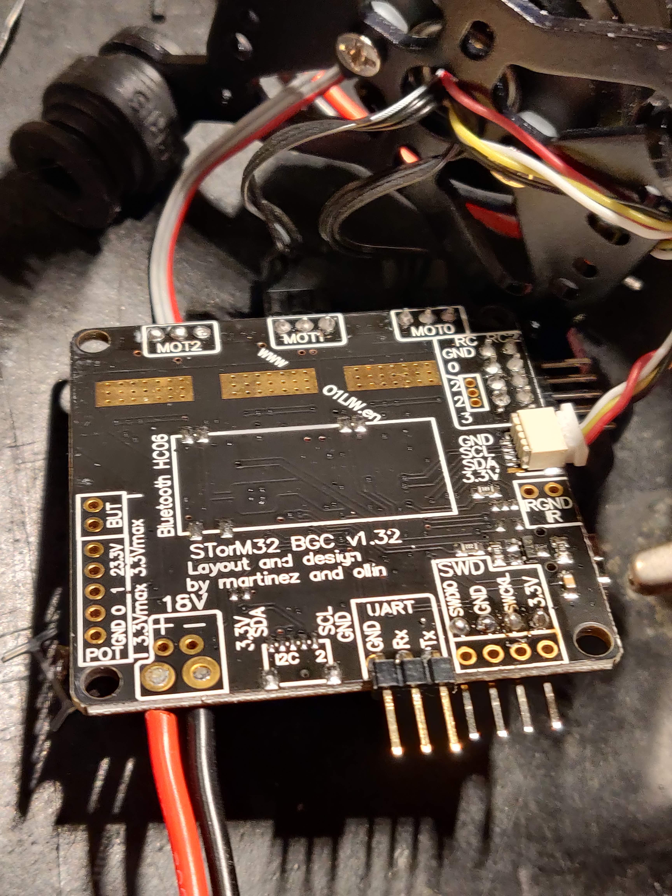

# Devlog 20/03/2023

```text
(Week 4, Monday)
tags: #os, #setup, #camera, #gimbal
```

## Notes

- I really need to get cracking

## Environments

- Tested gstreamer again, works ok in conda env `gst_1_0`
  - Installing in main conda env `RMS_3_8`
  - Installed successfully `:)`
- Deleted test conda environments

## Config

- Performed config changes as listed [in the install procedure doc](../install_procedure.md#post-install-configuration)

## Gimbal setup

- [Gimbal listing on AliExpress](https://www.aliexpress.com/item/1005002165612156.html)
- Soldered a JST to barrel plug connector for the gimbal
  - Didn't work
  - Soldered another
  - Didn't work
  - Removed JST from the gimbal board and swapped a third barrel female onto it
  - Works

### Gimbal Configuration

#### **Warning**

- This is the wrong GUI tool to use. It's for another line of gimbals, not the STorM32.

- Following [this video](https://www.youtube.com/watch?v=huQU7KmOG7s) somewhat
- Download [SimpleBGC GUI](https://www.basecamelectronics.com/downloads/)
  - Need to download the Java Runtime Environment
  - Doesn't wanna connect to the board (Windows or Ubuntu)
    - Tried installing Arduino drivers

```bash
sudo apt install default-jre
java --version
```

- Got the gimbal connected to another gui tool (see [this doc](../gimbal.md))

### Gimbal Issues

- Having issues with the gimbal
  - Freaking out and not staying level
  - Not actually self-levelling
  - Calibration freaking it out

#### Re-flashing Gimbal

- Will attempt to re-flash from `v0.90` to `v0.96` using [these instructions](http://www.olliw.eu/storm32bgc-wiki/How_to_flash_v1.x_STorM32_boards)
  - Using FTDI adapter
  - Download [Silicon Labs CP210x drivers](https://www.silabs.com/developers/usb-to-uart-bridge-vcp-drivers)
  - Attempting `v0.96` flash
    - "No response from target, the bootloader cannot be started"
    - Refuses to flash
      - Wiring is fine
      - Bootloader mode selected
      - Correct COM selected
      - COM (RS232 boi) working (as verified with HTerm)
      - XOR chip on RC0
    - Attempting flash loader demonstration through Windows XP instructions
      - No response from bootloader??
    - Attempting to remove read/write protections (should they exist?)
      - Unable to check because bootloader isn't recognised
    - Soldered on the STLink header and bought an STLink
    - Will try again once they arrive

## Images

[](./images/photos/IMG_20230320_154849.jpg)
[](./images/photos/IMG_20230320_164948.jpg)
[](./images/photos/IMG_20230320_190415.jpg)
[](./images/photos/IMG_20230320_212117.jpg)

## TODO

- [X] Push to GitHub (excluding `.config` GPS)
- [ ] Pull from master?
- [ ]
