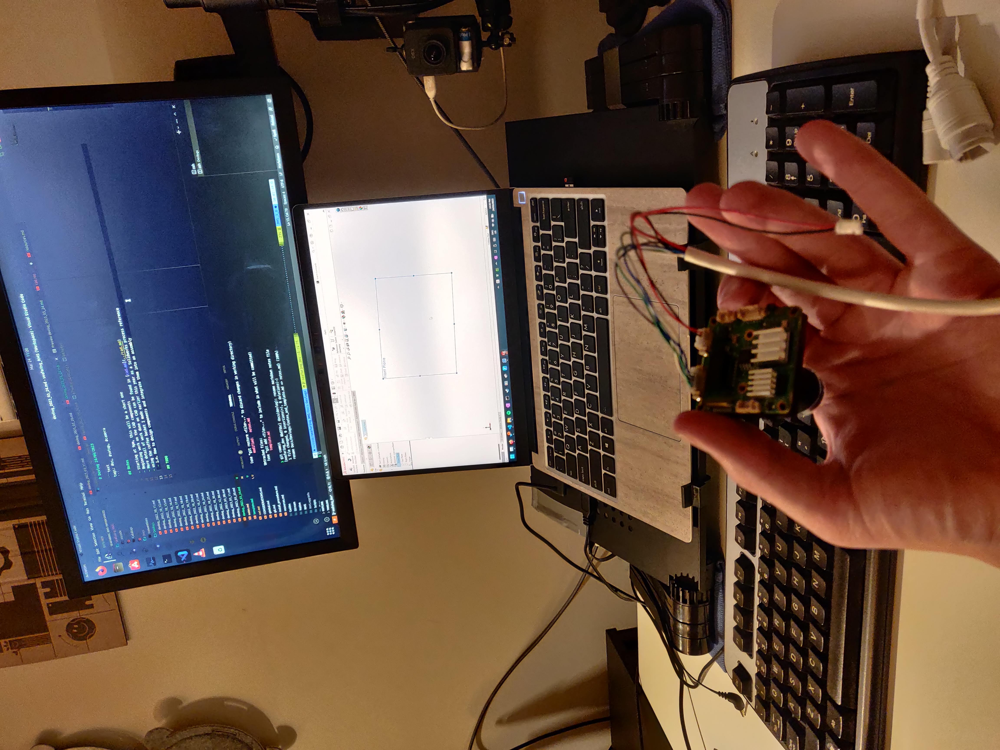

# Devlog 24/04/2023

```text
tags: #os, #setup, #camera
```

## Notes

- Starting at 9pm, this will be a short one
- Beginning work on the CAD components

## CAD

- More detail of work done on CAD can be found in [cad.md](../cad.md)
- Using the coffee basket I made earlier this year as a Solidworks process reference
  - i.e. How to design components and integrate them into an assembly
- Began design of gimbal camera mount
  - Begun designing basic camera model to use in mount construction
  - Found a better one online that's close enough to my camera model
    - Will import it and change parameters slightly to get a better model
  - Have already made the gimbal camera plate previously
  - Will make the camera mount itself in future

### Gimbal Camera Mount Design

- Best to stick with clips (ease of use, screws hard to come by)
- **Lens barrel clip**
  - Main support on M12 lens clip thing
  - Clips to PCB on the back of that
  - Supports to both

## Photos

[](./images/photos/IMG_20230324_222037.jpg)

- Taken while starting Solidworks design

## TODO
