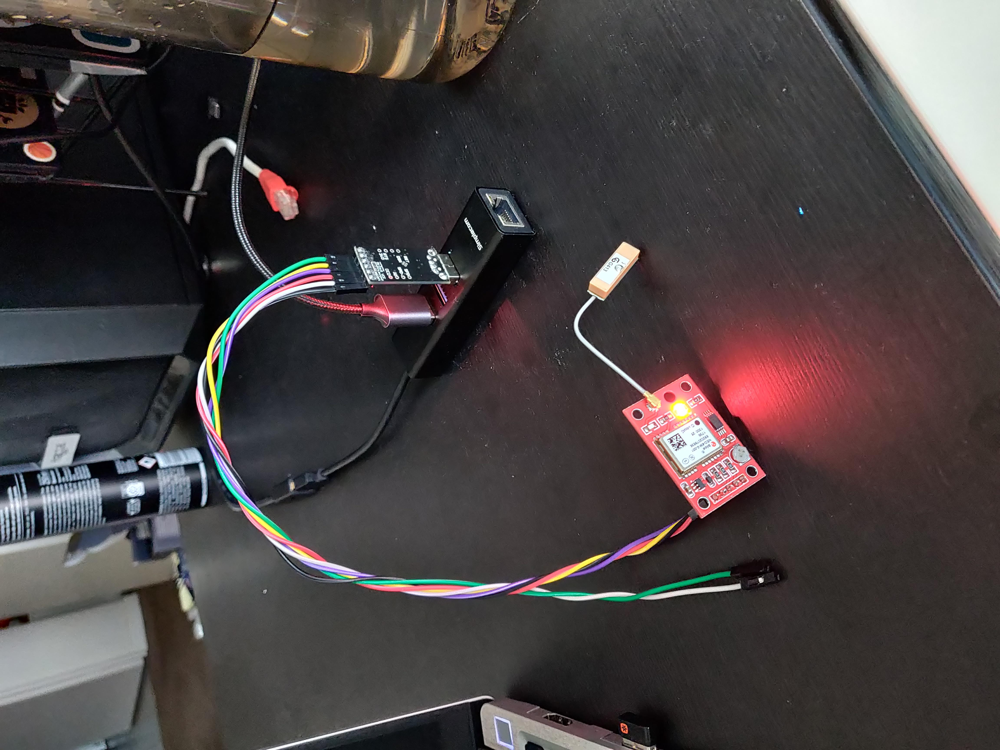

# Devlog 31/03/2023

```text
tags: #GPS, #python
```

## GPS

- Setting up GPS module for use with the RMS station.
- See [gps.md](../gps.md) for more information on the setup procedure
  - Testing detailed in devlogs

### Serial Terminal

#### Testing

- Connected successfully (Windows 11, `hterm`)
  - Appears to spit out GPS strings [in NMEA format](https://en.wikipedia.org/wiki/NMEA_0183)
- Linux testing (`minicom`)
  - `CP210x` driver supposedly [part of the Linux kernel](https://community.silabs.com/s/article/cp210x-driver-in-the-linux-kernel?language=en_US)
  - `ls /dev | grep USB`
  - `sudo minicom -D /dev/ttyUSB0 -b 9600`
    - `CTRL+A X` to exit
    - Works a treat

#### Terminology

- Serial terminal
- Serial console
- RS232
- TTL
- FTDI
- TTY
- UART

#### Programs

- Using `hterm` on Windows 11
  - `puTTY` is a good serial terminal program I've heard
  - `Termite` too
  - `Arduino serial module`
- Linux
  - `minicom`
  - `GTKTerm`
  - `puTTY`
  - `screen`

### Integration

#### Helpful Resources

- [NEO-M8N with Python and USB TTL](https://python.plainenglish.io/receiving-and-processing-gps-data-using-external-receiver-with-python-24d3592ad2e0)
  - [Jupyter notebook for the above](https://github.com/maxim75/data-visualization/blob/master/notebooks/gps_serial.ipynb)

#### Plan

- Steps
  - [X] GPS RS232 TLL terminal communication
    - [X] Windows 11
    - [X] Linux (Borealis)
  - [X] Python serial communication [`pyserial`]
  - [X] Python NMEA string decoder [`pynmea2`]
  - [X] Python data analysis [`GeoPandas`]
  - [X] Python maps [`contextily`]

### Result

- See [this Jupyter notebook](../../Tests/gps/gps_test.ipynb)
- GPS doesn't seem to get a satellite lock

## Images

[](./images/photos/IMG_20230331_170810.jpg)

- Picture of the `NEO-6M`

## TODO

- [ ] RS232 vs TTL vs FTDI vs TTY vs UART etc.
