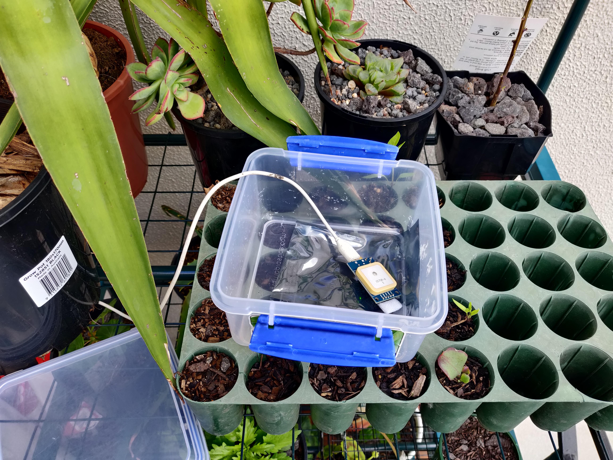
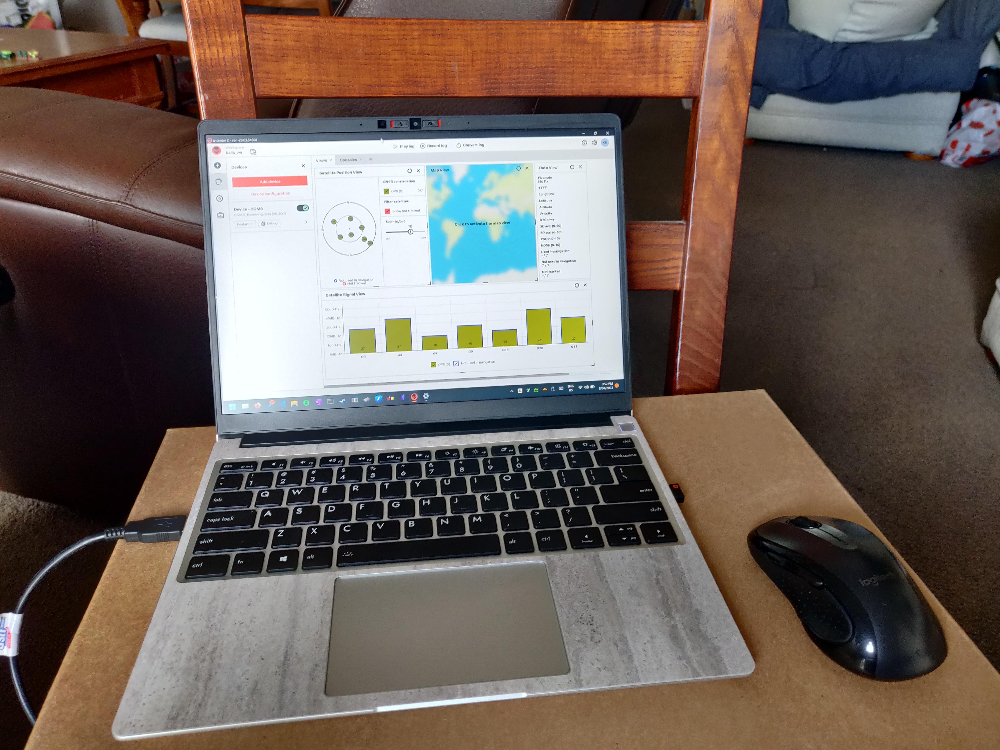

# Devlog 03/04/2023

```text
tags: #gps
```

## GPS Notes

### Issues with `NEO-6M`

### Solution for `NEO-6M`: The `NEO-7M`

- Went to Jaycar and got a [`NEO-7M` GPS](https://www.jaycar.com.au/duinotech-gps-receiver-module-with-on-board-antenna/p/XC3710)
  - Inbuilt antenna
    - Much larger ceramic as versus other `6M` module I have
  - Updated chipset (7-series) from u-blox
  - Direct microUSB port (no need for RS-232 TTL Adapter)

## `NEO-7M` Usage

### Initial Boot

- Needs ~1hr to charge internal battery for SRAM and satellite position memory
  - To build internal almanac
  - See [Time to First Fix](https://en.wikipedia.org/wiki/Time_to_first_fix)
  - Charged for ~50m

### Issues

- Altitude seems extremely variable
  - Ranged from 61.9m to 154.7m during testing
- Coordinate drift southeast
  - Corrected by hot reboot

# Images

[](./images/photos/IMG_20230403_155216.jpg)
[](./images/photos/IMG_20230403_155224.jpg)

- Images from testing the GPS (`NEO-7M`) module
  - First image shows GPS module outside (for greater signal)
  - Second images shows u-blox software (before the GPS obtained a fix)

## TODO

- [ ]
