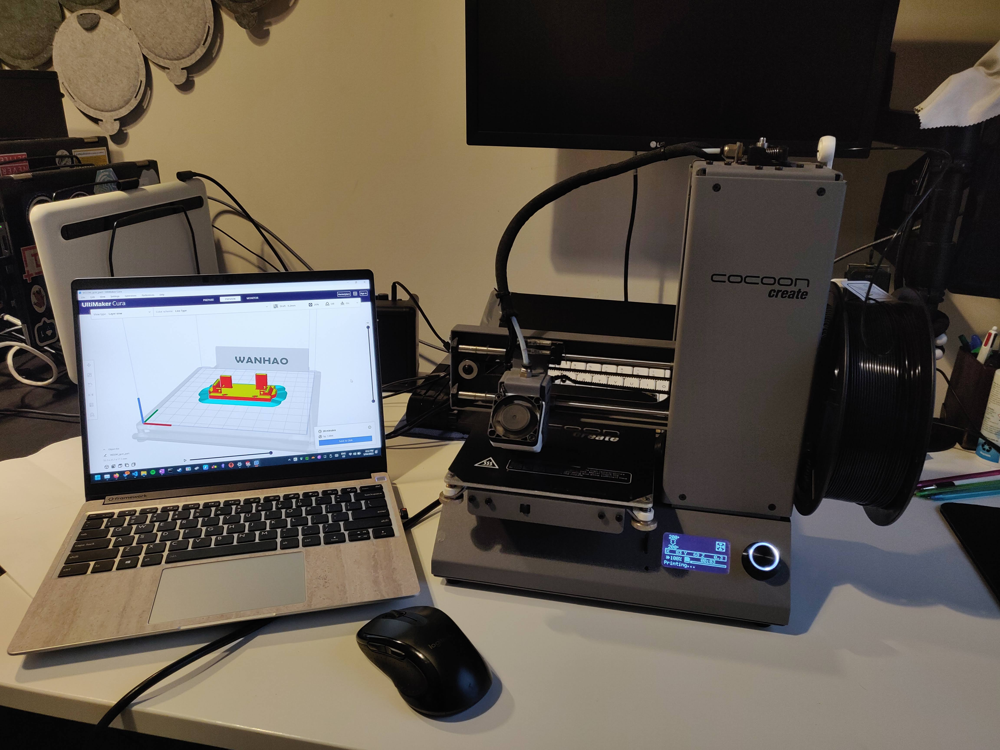

# Devlog 05/04/2023

```text
tags: #camera, #gimbal, #cad
```

## Notes

- Continuing work on camera gimbal mount CAD

## CAD

- Assessing [GMN camera mounts](https://docs.google.com/document/d/18TT-Jm7z9kYskl5ua07jQWD91OiyBemBnOosiNdW6nY/edit) to see how they do it
  - They use a screw plate design
- Names getting a little confusing
  - Committing to `"Gimbal Camera Mount"`
  - Abbreviated as `"gcm"`

### Workflow

- All parts designed (excluding `gcm`)
- Using [this video](https://www.youtube.com/watch?v=oOGOHqHaUdM&ab_channel=ANSOL) as a reference for assembly part design workflow

### `gcm`

- Completed the subassemblies necessary to model it
- Completed the first version of `gcm`
- Begun print of `gcm`
- Completed `gcm` print

#### Print results

- Mostly good print, few improvements required for v2 however
  - Move rear base plate holes out of the way of connectors
  - Move camera toward centre of base plate
  - Increase tolerancing (spacing) on camera width

## Further completed work

- Made necessary modifications for v2 of the `gcm`
- Organised component tub for easier future use (and transport)
- Camera cable improvements (for rigidity)
  - Added heatshrink
  - Added cable netting
  - Added hot glue to connectors

# Images

[](./images/photos/IMG_20230405_151013.jpg)
[](./images/photos/IMG_20230405_151025.jpg)
[](./images/photos/IMG_20230405_181228.jpg)
[](./images/photos/IMG_20230405_181640.jpg)
[](./images/photos/IMG_20230405_190930.jpg)

- First image shows the camera (upright) from the back
- Third image shows `gcm` v1 part being printed
- Fourth image shows the initial few layers of the print
- Fifth images shows the completed print

## TODO

- [ ] thing
