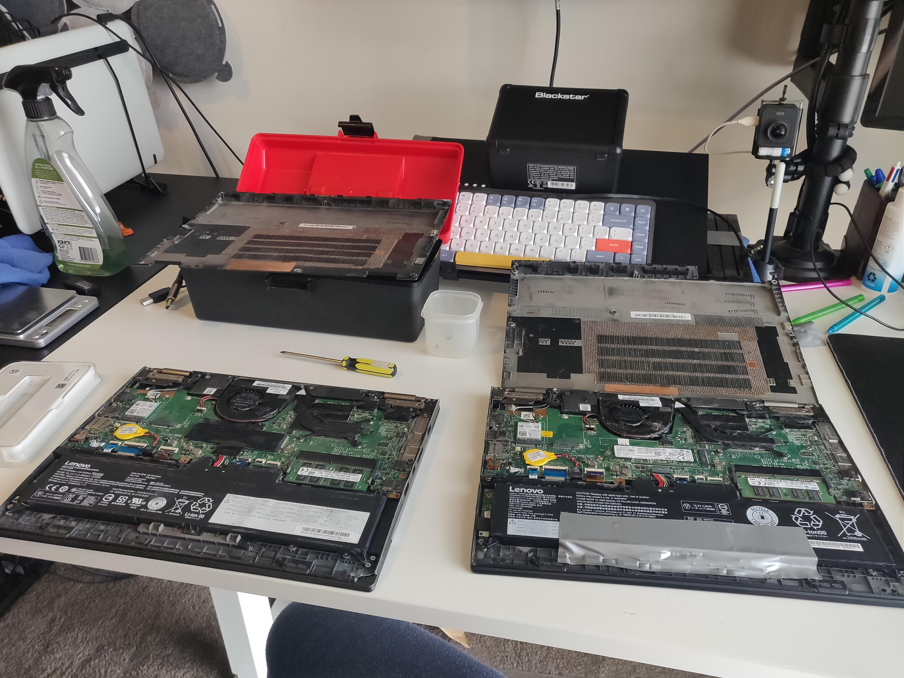
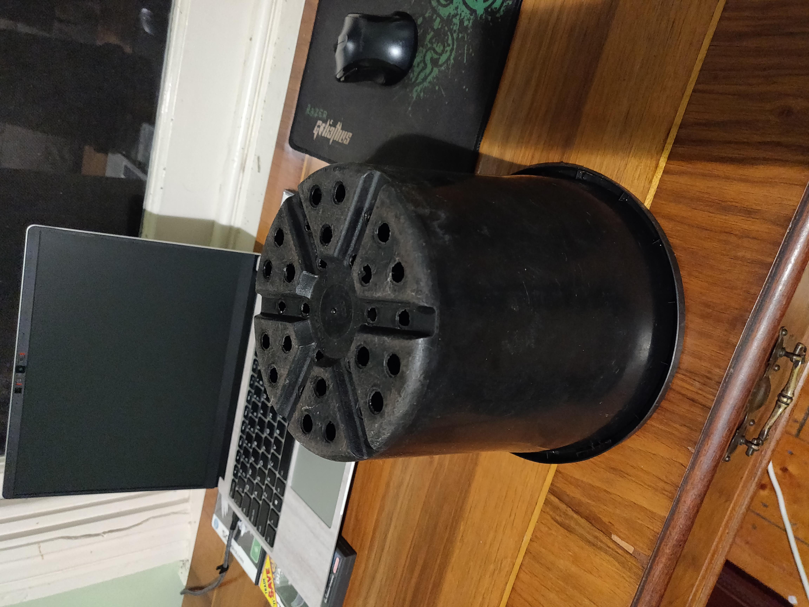
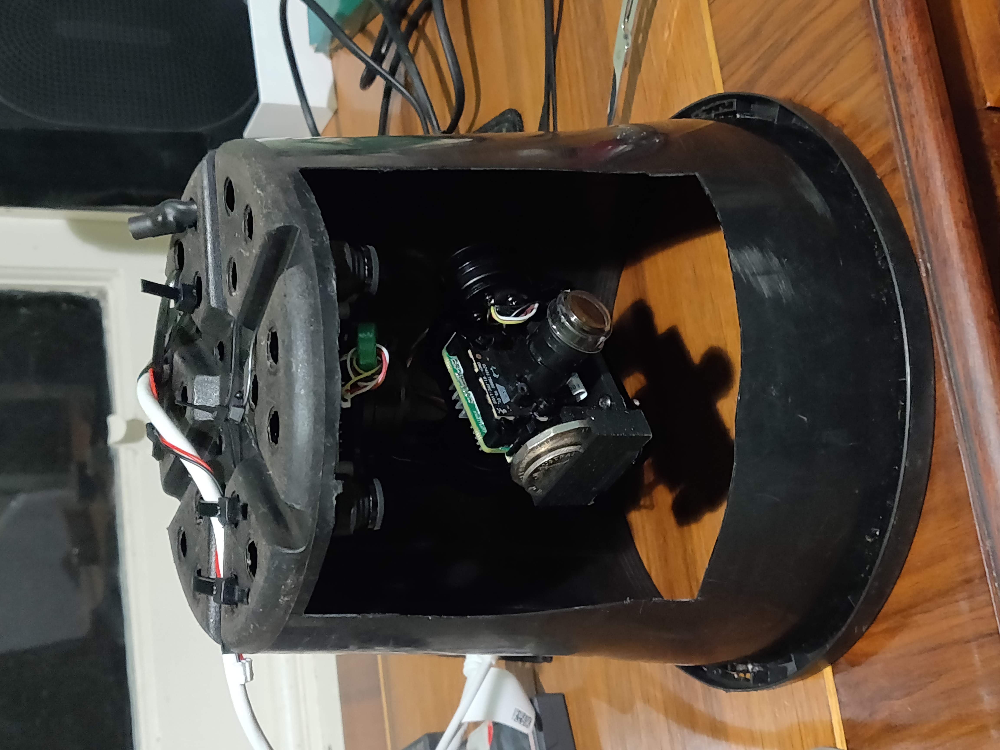

# Devlog 08/04/2023

```text
tags: #os, #borealis
```

## Drive Swap

- The current RMS computer (Borealis) is one of 2 Lenovo Yoga 260 laptops I own
- It however has a busted keyboard, cracked screen (among other things)
- So it's worth trying to move it to the other computer
  - Hardware is identical, so I see no reason it shouldn't be compatible

### Swap process

- Open both computers, transferred the drives
- The new Borealis seems to boot fine
  - Trackpad doesn't work but that's ok

[](./images/photos/IMG_20230408_102606.jpg)

- Photos of the two laptops opened and ready for swapping

## Preliminary Gimbal Testing

- Simple test
- Plugging camera and gimbal in (while mounted) to ensure systems work

### Gimbal Scripting

- [See this wiki page](http://www.olliw.eu/storm32bgc-v1-wiki/STorM32_Scripts)
- Didn't get it working with the script below:

```text
SETANGLEPITCH angle(20.0)
SETANGLEROLL angle(0.0)
SETANGLEYAW angle(0.0)
```

## Physical Designs

- Ideated designs for:
  - Gimbal to tripod mount
  - Camera indoor light shield
  - Temporary rain protection solution for testing

## Gimbal Mount

- Made a rudimentary yet highly effective mount for the gimbal
  - Mount is an upside-down black plastic plant pot - with a hole cut in the side for the camera's viewport
- Works surprisingly well
- Features:
  - Enclosed design means light from behind the camera is blocked
  - Drainage holes provide convenient mounting and cable routing holes
  - Plastic is rigid enough to hold assembly
  - Commercially available

An image of the pot beforehand, and the mounted gimbal after modification is shown below:

[](./images/photos/IMG_20230408_210957.jpg)
[](./images/photos/IMG_20230408_231347.jpg)

- Mounting solution for the gimbal
  - Visible on the camera's right side is the counterweight (consisting of a 10c and a 50c coin)

## Additional Notes

### Camera Cable improvements

- All the following improvements made in the name of flexibility
  - Removed cable netting on camera power / data cable
  - Stripped back outer wire insulation on cable
  - Twisted cables around each other somewhat (per connector)

## TODO

- [ ] thing
