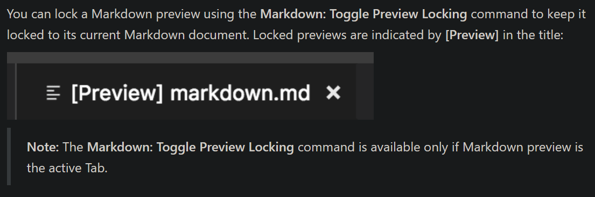

# Devlog 09/04/2023

```text
tags: #test, #docs, #gimbal, #python
```

## Notes

### Testing

- Had planned to test today, skies are unfortunately cloudy (see image below)

[](./images/photos/IMG_20230409_211320.jpg)

- Doing the following instead:
  - Test procedure planning
  - Documentation updates (primarily devlogs)
  - Gimbal interfacing / PC control
  - Repository pushes / updates

### Markdown

- Normal preview = open a preview pane that changes what file it's previewing based on the last selected one by the user
- locked preview = preview a specific markdown file and don't ever change which file it's previewing

[](./images/markdown_preview_locking.png)

- From the vscode docs

## Gimbal Interfacing

- Ideas:
  - Python serial USB
    - Reverse engineer BGC packets / scripting
  - Use [the existing Python gimbal comms library](https://github.com/olliw42/storm32bgc/tree/master/py-library)
  - Python -> Arduino -> Gimbal RC inputs
  - Onboard scripts
    - Trigger thru Python (over USB or thru Arduino)

### Python Testing

- Made and tested [a working script](../../Tests/gimbal/static_pose.mcs) for the `o323bgc` GUI gimbal tool

## TODO

- [ ] Gimbal orientation control
  - [X] Manual (GUI scripting)
  - [ ] Python
