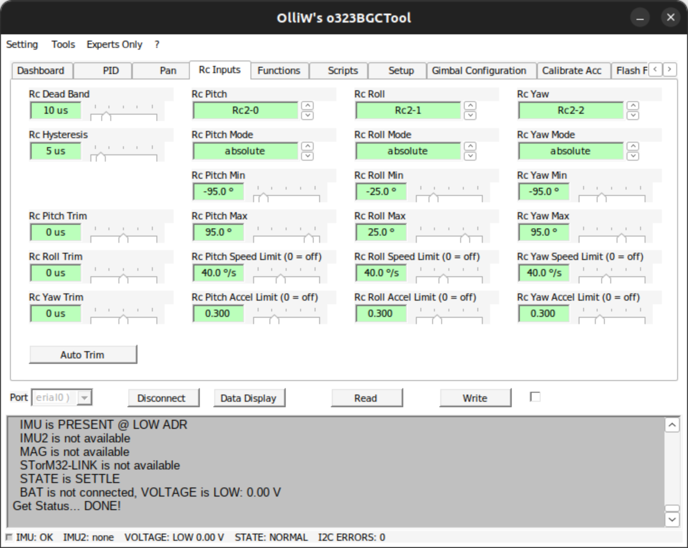
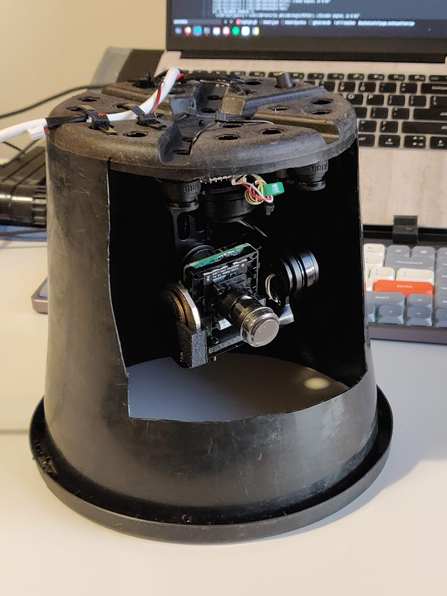
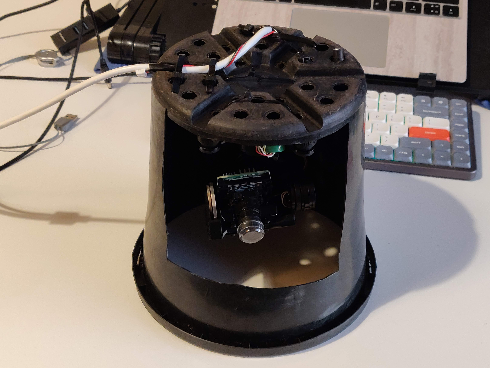

# Devlog 13/04/2023

```text
tags: #gimbal, #python
```

## Notes

- I think `CMD_SETYAW` only works from -90 to +90 degrees
  - After further research it's because this command sets the yaw with limited values
  - See the link below and the [RC Inputs Settings subsection](./devlog_2023_04_13.md#rc-inputs-settings)
- Found [an extremely important wiki link](http://www.olliw.eu/storm32bgc-wiki/Inputs_and_Functions#Rc_Input_Processing)

### RC Inputs Settings

[](./images/rc_inputs.png)

- Screenshot of the Windows GUI tool running through [wine](https://www.winehq.org/) on Ubuntu

## Further notes

- Added images to devlogs (retroactively from camera roll)
  - Striped EXIF data with `exiftool ./* -all=`
  - Added images [photos folder](./images/photos/)
  - Put in devlogs
  - Audit before push

## Images

- More photos of the gimbal in its plastic pot mount

[](./images/photos/IMG_20230413_180608.jpg)
[](./images/photos/IMG_20230413_180621.jpg)
