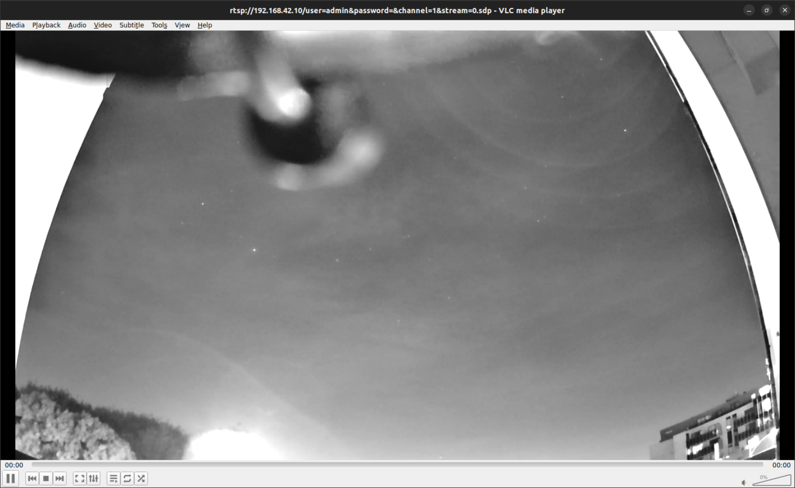

# Devlog 14/04/2023

```text
tags: #gimbal, #test, #rms
```

## Notes

- [X] Recalibrate gimbal (level IMU)
  - Before and after (1st and 2nd respectively) shown below

[](./images/calibration_pre.png)
[](./images/calibration_post.png)

## PID tuning

### Current PIDs

- Work well, however issues arise when the gimbal goes beyond certain limits
- Begins shaking etc.
- Retuning PIDs may help solve / mitigate this
  - Use [the tuning recipe](www.olliw.eu/storm32bgc-wiki/Tuning_Recipe)

[](./images/PIDs_pre.png)

### Counterweight updates

- Important to balance the gimbal

#### L / R tilt balancing

- Previously had a 10c and 50c coin as a counterweight (21.0g)
  - This was slightly too heavy
- Changed counterweight to a 20c, 10c and 5c coin (19.7g)
  - Better

#### Front / back tilt balancing

- This is much more difficult
- Would require a redesign of the `gcm` part (gimbal camera mount)
  - Redesign would need to add some kind of counterweight slot behind the camera
  - Could be worth later in the project if I have time

## RMS Full Setup & Static Run

- Reinstalled some zipties for better holds
- **Full test detailed in [this test document](../../Tests/stock_RMS/2023_04_14_stock_RMS_test.md)**

## Wine

- Reinstalling Wine because for some reason it doesn't launch the GUI tool anymore ((nothing changed))
  - Followed [this removal guide](https://askubuntu.com/questions/15551/how-to-remove-wine-completely)
  - Then reinstalled with `sudo apt install --install-recommends winehq-stable`
- Didn't work
  - I just redownloaded the gui tool from [here](https://github.com/olliw42/storm32bgc/blob/master/firmware%20binaries%20%26%20gui/o323bgc-release-v096-v20160319.zip)
  - Works like a charm `¯\_(ツ)_/¯`

## Further Physical Modifications

- Light reflecting off windows from the LEDs on the gimbal PCB and IMU are causing camera artefacts
  - [x] Tape over LEDs
- Camera needs a higher tilt range to get useful data
  - [x] Move gimbal closer to the edge of the pot
  - [x] Put things under the pot to tilt the pot itself

## ⚠️ Issues to Address

Issues discovered while testing the RMS.

- Yaw drift
  - Fix with 2nd IMU (once it arrives)
- gstreamer pipeline borked
  - Try with the new ffmpeg pipeline instead
  - Read thru RMS logs on Borealis
- Absolute gimbal positioning (relative to board orientation)
  - Requires 2nd IMU
  - Necessary for good initialisations on the gimbal

## Image Gallery

### Visibility Testing

This section is prior to remounting the camera. As such, parts of the gimbal mount and plant pot the gimbal is mounted in are visible in some frames.

[](./images/meteor_cam_pics/balcony_dim.png)

- Picture showcasing the stars visible from the balcony

[](./images/meteor_cam_pics/balcony_ok_stars.png)

---

### Lens Cap Testing

As a protective measure, I've kept the plastic cap that came with the lens on.
As shown below, it makes a vast difference to streakiness blurriness of the image.

[](./images/meteor_cam_pics/balcony_lens_cap_off_w_street_light.png)

- Lens cap off

[](./images/meteor_cam_pics/balcony_lens_cap_on_w_street_light_2.png)

- Lens cap on

---

### Internal Reflection Testing

As is evidenced by the images below, without proper mitigation, the RMS is vulnerable to internal reflections.
In order to eliminate reflections off the inside of the window, the RMS must have an opaque "seal" with the window.

[](./images/meteor_cam_pics/bedroom_good_stars_bad_LED_refls.png)

- Capture when all room lights are off
- Note the large artefact in the centre of the screen from the red and green status LEDs on the gimbal control board

[](./images/meteor_cam_pics/bedroom_cloudy_stars.png)

- Capture when all room lights are off (and LEDs taped over)

[](./images/meteor_cam_pics/bedroom_lamp_on.png)

- Capture when a USB LED lamp is on in the room

---

### Yaw Drift Imagery

These images were taken over the course of ~30 minutes. The gimbal was sitting on a table, stationary on flat ground.
These photos show the gimbal slowly yawing clockwise due to small accumulated errors. This can likely be solved with:

- A secondary IMU for the gimbal
- Use of a magnetometer

[](./images/meteor_cam_pics/bedroom_1.png)

- Captured `Sat 15 Apr 2023 00∶08∶05`

[](./images/meteor_cam_pics/bedroom_2.png)

- Captured `Sat 15 Apr 2023 00∶12∶57`

[](./images/meteor_cam_pics/bedroom_3.png)

- Captured `Sat 15 Apr 2023 00∶34∶12`

## TODO

- [ ] look into [this](http://www.olliw.eu/storm32bgc-wiki/Advanced_Functions)
  - Goes in hand with [this](http://www.olliw.eu/storm32bgc-wiki/STorM32_Parameters)
  - [this](http://www.olliw.eu/storm32bgc-wiki/Serial_Ports)
  - Suck the parameters out of GUI logs and the serial commands wiki page
- [ ] Retune gimbal PIDs
- [ ] Set gimbal angle limits
- [X] Gimbal orientation control
  - [X] Manual (GUI scripting)
  - [X] Basic control (Python)
  - [ ] Comprehensive control (Python)
