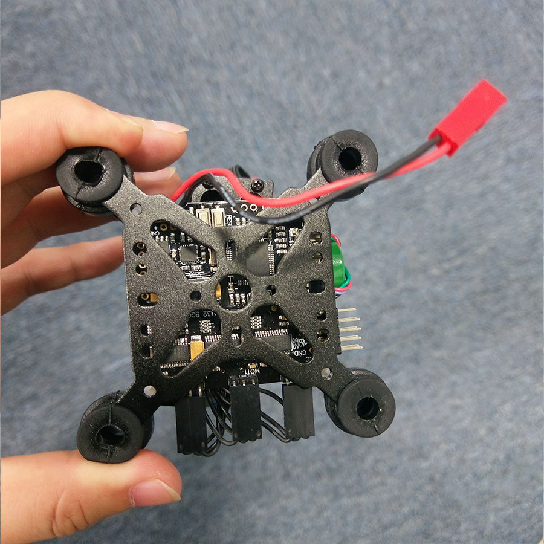
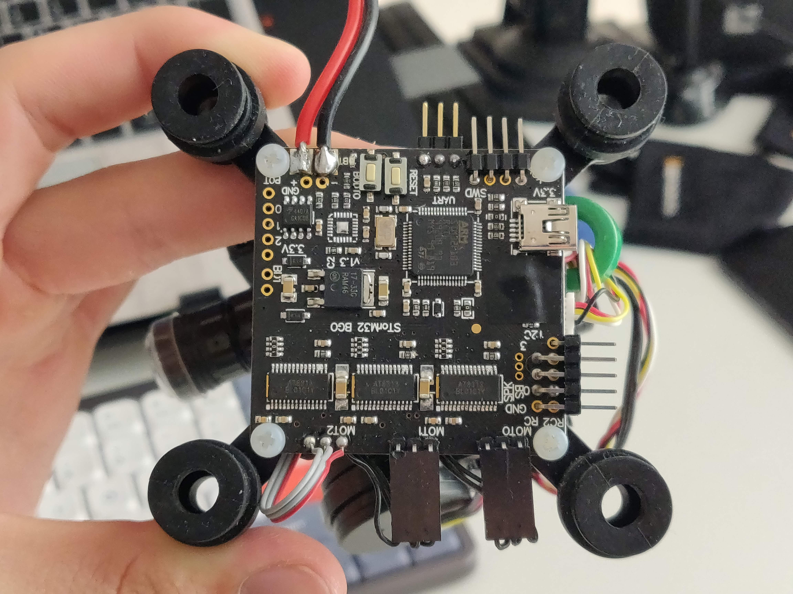
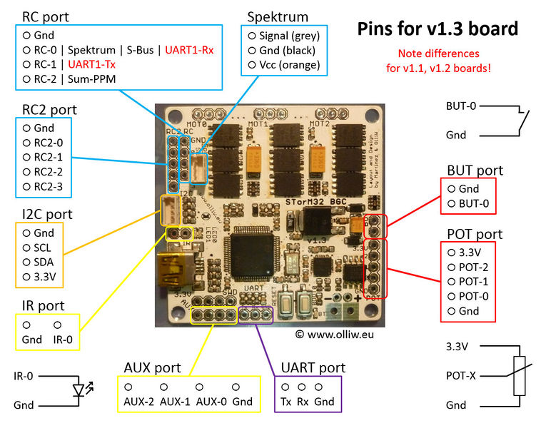
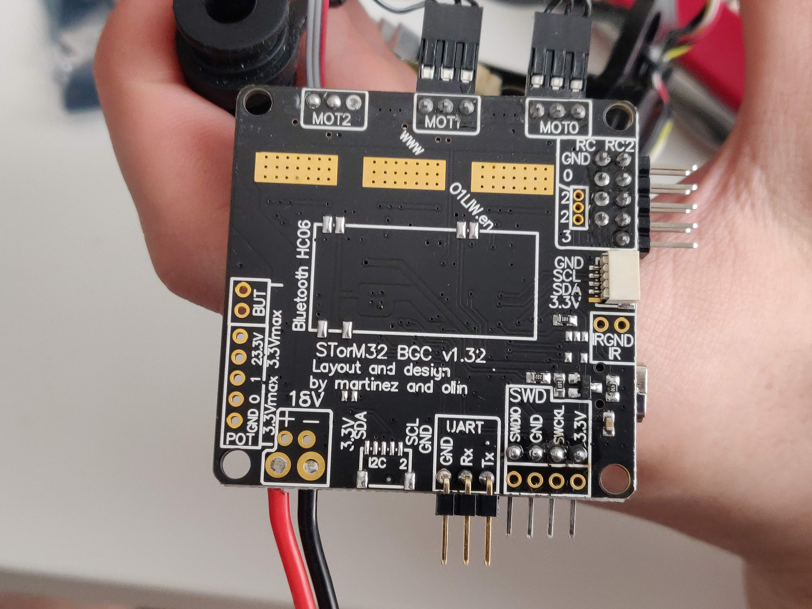
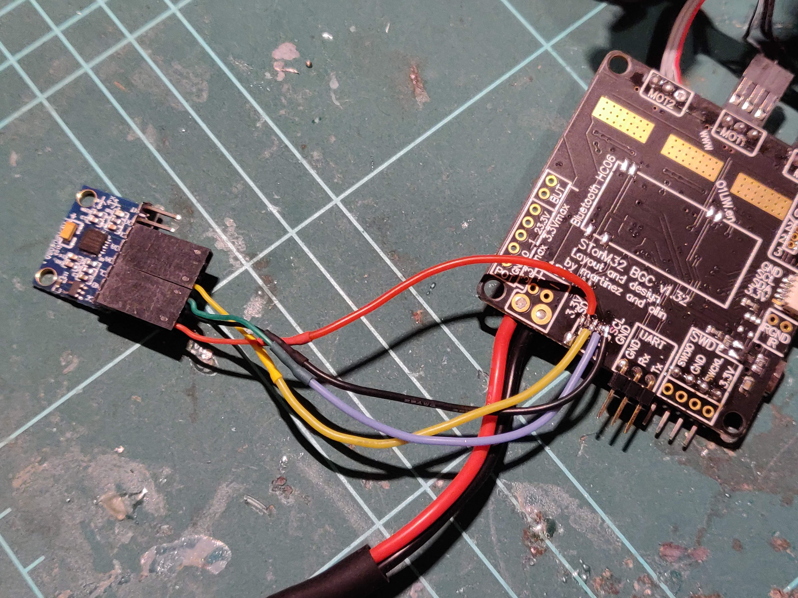
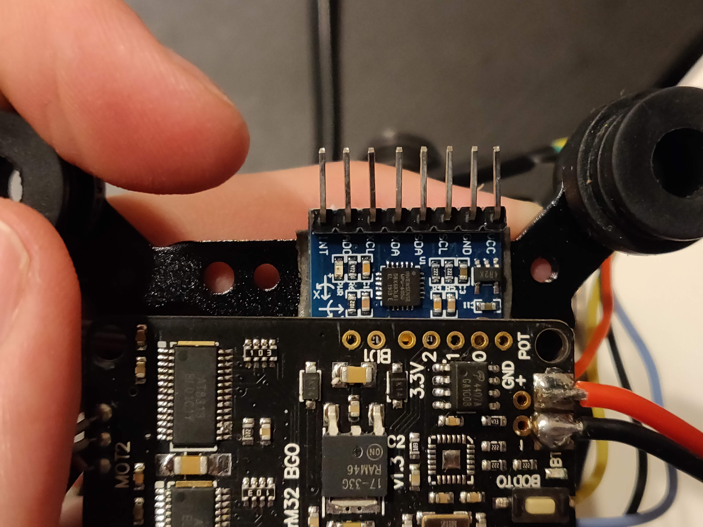

# Devlog 26/04/2023

```text
tags: #gimbal, #IMU
```

## IMU Notes

- New `MPU6050` IMUs arrived today, attempting connection to STorM32 gimbal

### Board Status

[](./images/photos/control_board_listing_photo.jpg)
[](./images/photos/control_board_own_photo.jpg)

First image is a photo of the board as on its [AliExpress listing](https://www.aliexpress.com/item/1005002165612156.html)
Second image is a photo of the board I received

- Above are two photos of the STorM32 Gimbal Control Board (hardware version 1.30)
- The Aliexpress photo shows the board with a chip in present in the top left
- My photo shows the same board without that chip
- The missing chip is an `MPU6050` IMU

### The need for a 2nd IMU

- [This wiki page](http://www.olliw.eu/storm32bgc-v1-wiki/Using_a_2nd_IMU) details the benefits of having a 2nd IMU
- Above this however, it's important for addressing yaw drift for long periods of operation

## IMU Installation

### Pinout

[](./images/datapics/770px-Storm32-bgc-v13-ports-and-connections.jpg)

- Above is a photo of the [board pinout for hardware version 1.30](http://www.olliw.eu/storm32bgc-v1-wiki/Pins_and_Connectors)

### I2C

- Using version 1 of the wiki (as we're using a STorM32 board, not T-STorM32)
  - (Using I2C instead of the NT bus)
- Useful links
  - [Using a 2nd IMU (v1 wiki)](http://www.olliw.eu/storm32bgc-v1-wiki/Using_a_2nd_IMU)
  - [Pins and Connectors (v1 wiki)](http://www.olliw.eu/storm32bgc-v1-wiki/Pins_and_Connectors)

- As quoted from the v1 wiki page on using a 2nd IMU:

*The external IMU module would be connected to the I2C#2 connector on the bottom side of the STorM32 board. Doing so automatically selects the external IMU module as 2nd IMU. If no IMU module is connected to I2C#2, the on-board IMU is selected. So you don't have to change anything in the GUI, the external IMU module is used automatically when connected.*

*Comment: The on-board mpu6050 IMU is connected to the I2C#2 connector internally and is set to a non default i2c address. If you connect an external IMU to the I2C#2 connector it can be recognized by its default i2c address and is selected.*

[](./images/photos/control_board_own_photo_underside.jpg)

- Photo of the underside of my control board
- Visible to the right of the power wires in the image's bottom left is the 2nd IMU connection point
- This is where we will be connecting the secondary IMU module
- Manufacturer also didn't include a connector (like on the I2C#1 port) here
  - Connector is called a JST-SH (1.0mm pitch)
  - Potentially the same as 1.25mm pitch JST / Molex PicoBlade??
- So will have to install a connector or alike

### Installation options

- SMD desolder and resolder MPU6050 chip to STorM32 board
- Direct solder wires to I2C pad #2, pins on MPU6050
- Find a JST-SH connector, desolder and resolder it to the STorM32 board, connect MPU6050 module

### Actual Installation

- Attempted to desolder a port from the magnetometer to use
  - Absolutely did not work
  - Would need a heat gun / solder oven
- Ended up doing the following:
  - Soldered pins to the `MPU6050`
  - Soldered wires directly to the `I2C#2` pad
  - Hot glue over I2C pads to protect them
  - Connected female pin header to `I2C#2`

[](./images/photos/IMG_20230426_173701.jpg)
[](./images/photos/IMG_20230426_181547.jpg)

- Photos of the installed IMU and the wired soldered to the `I2C#2` connector pins

### Software Setup

- [x] 2nd IMU Calibration
- [x] 2nd IMU orientation setting

## Results

- IMU works fine

## TODO

- [ ] thing
