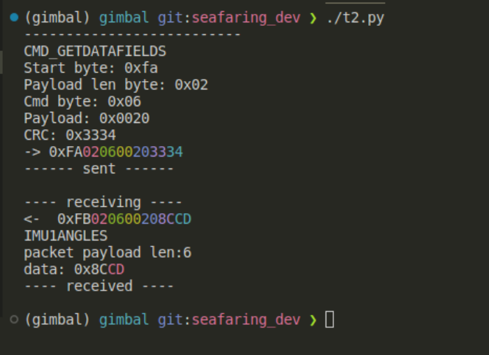

# Devlog 03/05/2023

```text
tags: #stormfront, #gimbal, #python
```

## IMU connection issue

- Issues with camera IMU detection on the gimbal
  - Doesn't connect for some reason, then when it does, it produces heaps of I2C errors
  - Nothing changed since last time, unsure what's wrong
- Solution
  - Disconnected camera IMU
  - Power cycled gimbal
  - Reconnected camera IMU
  - Powered gimbal
  - Works

Note:
This indicates robustness issues with the gimbal system.
Potentially means the system isn't suited for a "set-and-forget" type scenario.
Might require regular maintenance and someone with knowledge of the system to repair it.

## Git

- Pushed old changes
- Stripped exif

## Stormfront work

- Need data collection capability (most notably of IMU data)
  - Required for automated testing

Works thus far:

```text
--------------------------
CMD_SETYAW
raw angle: 10.0
mapped angle:  10.0
mapped_int: 1584
Start byte: 0xfa
Payload len byte: 0x02
Cmd byte: 0x0c
Payload: 0x3006
CRC: 0x3334
-> 0xFA020C30063334
------ sent ------

---- receiving ----
<-  0xFB019600622E
ACK_OK
---- received ----
```

### Progress on `stormfront`

- Check commit activity on repo for this date
- Alternatively, see below:
  - Added hex colourisation
    - Makes it easier to distinguish bytes from one another when printed
  - Added packet receive ability
  - Added packed decode ability
    - Not fully implemented
  - Modified some test scripts

[](./images/stormfront_packet_response.png)

## TODO

- [ ] thing
