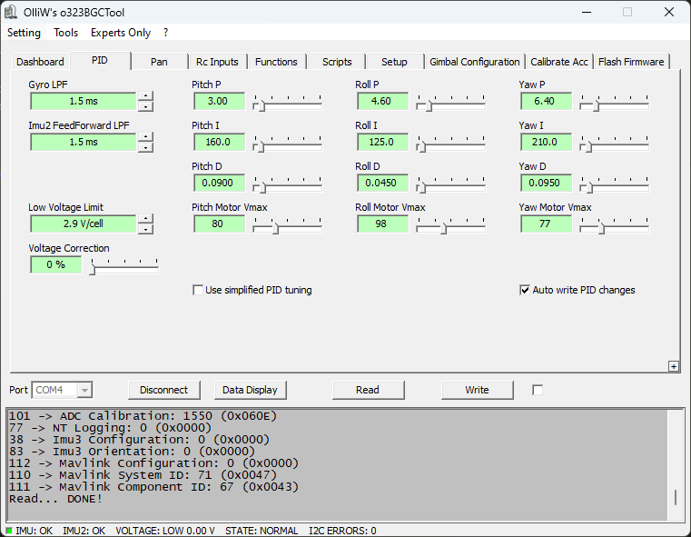

# Devlog 05/05/2023

```text
tags: #python, #gimbal, #stormfront
```

## Stormfront

### Packet decoding

- On [the wiki for firmwares up to v0.96](http://www.olliw.eu/storm32bgc-v1-wiki/Serial_Communication), there is a section for command "`d`"
- This section has a snippet of C code from the gimbal firmware
- [The snippet](../../Tests/gimbal/storm32_repo_files/serial_comms_snippet.c) details how values are encoded

### IMU Pitch, Roll, Yaw encoding

Respective C snippets:

```c
((u16*)fbuf)[(*len)++]= (s16)(100.0f*fImu1Angle.Pitch);
((u16*)fbuf)[(*len)++]= (s16)(100.0f*fImu1Angle.Roll);
((u16*)fbuf)[(*len)++]= (s16)(100.0f*fImu1Angle.Yaw);

((u16*)fbuf)[(*len)++]= (s16)(100.0f*fImu2Angle.Pitch);
((u16*)fbuf)[(*len)++]= (s16)(100.0f*fImu2Angle.Roll);
((u16*)fbuf)[(*len)++]= (s16)(100.0f*fImu2Angle.Yaw);
```

> Float angle \* 100.0 (float) \* cast to signed 16 bit int `-->` append to transmission buffer

- [Test code for C casting linked here](../../Tests/gimbal/c/casting.c)
- Need to determine endianness

### Issues

- Getting live data (`CMD_GETDATAFIELDS`) doesn't seem to always behave so well
- Doesn't do `IMU1ANGLES`
  - Returns a blank datastream
- But `IMU2ANGLES` returns a packet 12 bytes long (10 datastream bytes)
  - **However**, the datastream received is always `0x06007090000000000000`
- For time being, might need to work on `d` command instead `:(`

## PID Tuning

- Once again, following [this recipe](http://www.olliw.eu/storm32bgc-wiki/Tuning_Recipe)

> Prior PIDs

[](./images/pre_retune_pids.png)

- Turns out the gimbal didn't need new PIDs
- Just needed the correct IMU2 configuration set
  - Was `configuration 1: -y x z`
  - Is now `configuration 2: -x -y z`
- Small PID issues:
  - Begins shaking if camera disturbed too much
  - Begins high frequency motor shake at extreme pitch tilt
  - Neither of these should be issues, as they're both out of the gimbal's expected angle variance

## Mount

- Put gimbal back into mount (plastic pot)
- Reconnected camera

## Pipeline Upgrade (`FFmpeg`)

- Documentation for pipeline testing [is linked here](../../Tests/stock_RMS/video_pipelines/may_5_2023_pipeline_testing.md)

### Note

- It has become apparent that the GMN have updated their tutorial pages since I began this project
- This is excellent news, however, it means some links in [resources.md](../resources.md) are outdated

### Upgrade notes

- Upgrading pipeline from `gstreamer` to `FFmpeg` since it doesn't boot on `Borealis` as of yet
  - Hopefully the pipeline upgrade will change this
- See [the Linux Install page on the GMN wiki](https://globalmeteornetwork.org/wiki/index.php?title=Installation_for_Linux) for install instructions
- Possibly, the problem is VAAPI plugins on Ubuntu?

#### Config strings

```bash
# gstreamer with hardware acceleration through VAAPI
device: rtspsrc location=rtsp://<camera-ip>:554/user=admin&password=&channel=1&stream=0.sdp ! rtpjitterbuffer ! rtph264depay  ! h264parse ! vaapidecodebin ! videoconvert ! appsink

## FFmpeg with no hardware acceleration
device: rtsp://<camera-ip>:554/user=admin&password=&channel=1&stream=0.sdp

# Check pipeline works with the following command:
python -m Utils.ShowLiveStream
```

### FFmpeg

- Version `4.4.2` (latest is `5.1.3`)
- `ffmpeg -version` shows VAAPI support is enabled

### **Note v2**

- Didn't need to upgrade pipeline, works with a modified gstreamer call in the config file
-

## General Notes

- Pushed some stuff to the repo (mainly `stormfront` changes)
- Pushed the day's changes

## System Testing

- Made a wiring harness to use for later testing of the system in a moving car
  - Consists of a cigarette lighter socket to a 12v regulator to 2x DC barrel plugs
    - 1x barrel plug for the camera
    - 1x barrel plug for the gimbal

## TODO

- [ ] thing
