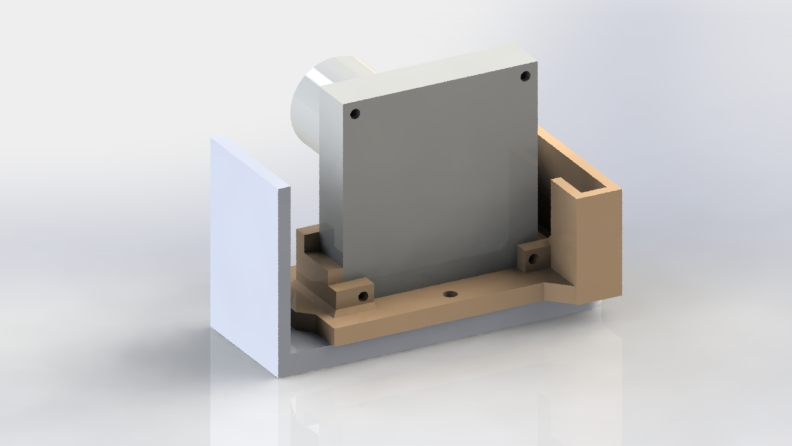
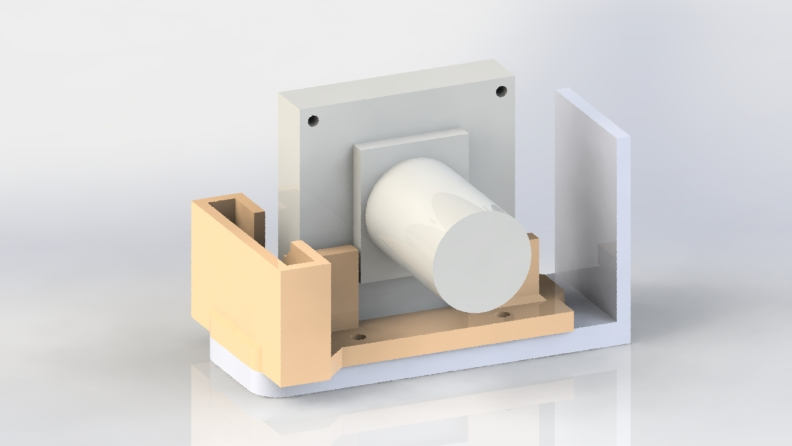
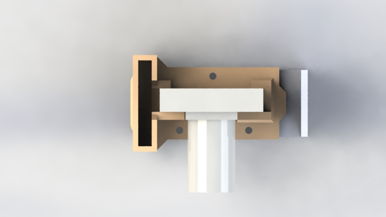
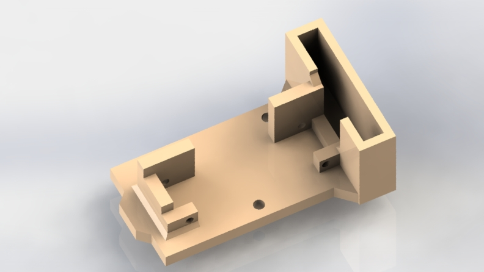
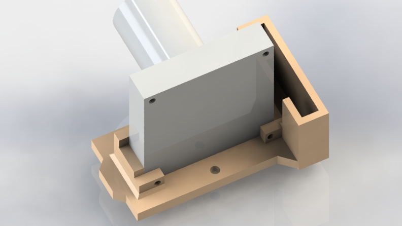
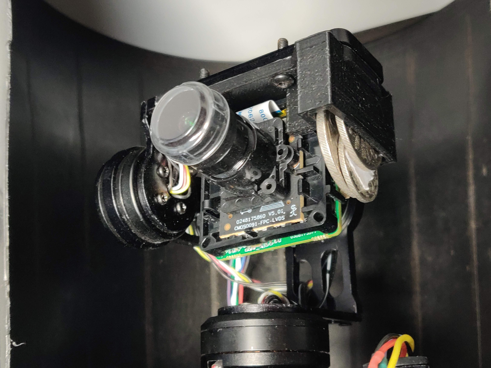
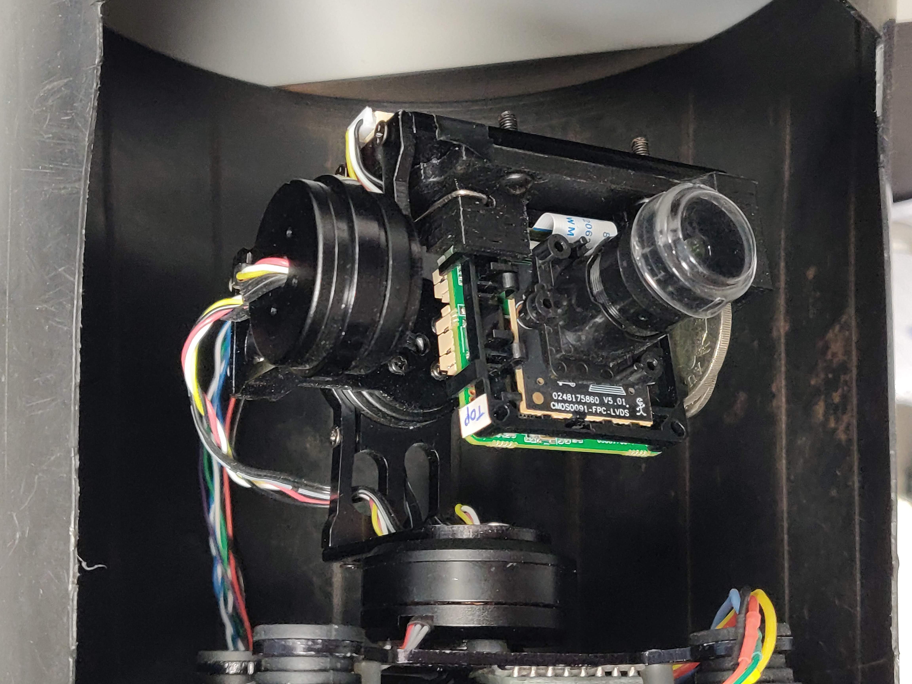

# CAD

- This document details the considerations for designing each CAD component.

## Gimbal Camera Mount

- Abbreviated as `gcm`

### Part Description

- This part connects the gimbal camera mount plate to the camera itself

### Features

- Counterweight slot for roll balance
  - Using coins for such
- Screw into base plate
- Holes to secure IMX291 camera in place

### Considerations

- Spot for camera wires
- Heatsink / airflow area (ventilation)
- Printability (no complex / floating geometry)
- Flexibility of final design
- Consideration of irregular surface of camera and components

### Devlogs

List of devlogs wherein I worked on the `gcm`.
All have `#cad` or `#CAD` in the name.

- [📄 devlog_2022_10_25.md](./Devlogs/devlog_2022_10_25.md)
- [📄 devlog_2023_03_25.md](./Devlogs/devlog_2023_03_25.md)
- [📄 devlog_2023_04_05.md](./Devlogs/devlog_2023_04_05.md)
- [📄 devlog_2023_04_06.md](./Devlogs/devlog_2023_04_06.md)
- [📄 devlog_2023_04_07.md](./Devlogs/devlog_2023_04_07.md)
- [📄 devlog_2023_04_08.md](./Devlogs/devlog_2023_04_08.md)
  - No CAD here, just physical implementation of other
- [📄 devlog_2023_04_14.md](./Devlogs/devlog_2023_04_14.md)
  - No CAD here either, just work on balancing gimbal properly with counterweights

### Image Gallery

- Some renders of the Solidworks gimbal assembly

#### Full Assembly Render

---

#### Partial Assembly Render

---

#### Final Product

---

