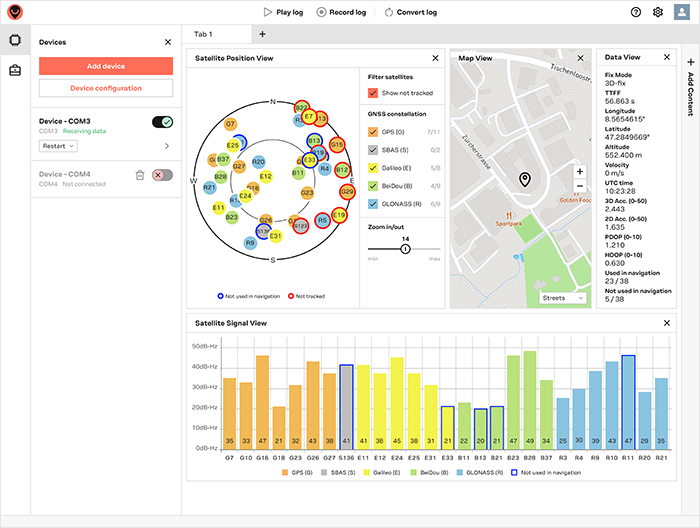

# GPS

- This document explains the following with relation to the GPS module in this project
  - Module & RS232 adapter details
  - Setup
  - Configuration
  - Interfacing (through a USB port)
  - Python bindings
  - Usage in `seafaring_RMS`

## GPS Overview

- L1 band extremely common for GPS / GNSS
  - E1 too - same centre freq as L1 just bigger bandwidth

```text
GPS L1 Band: 1575.42 MHz with a bandwidth of 15.345 MHz - 0.19 metre wavelength
GPS L2 Band: 1227.6  MHz with a bandwidth of 11     MHz - 0.24 metre wavelength
GPS L5 Band: 1176.45 MHz with a bandwidth of 12.5   MHz - 0.25 metre wavelength
```

## Software

### [u-blox u-center](https://www.u-blox.com/en/product/u-center)

[](./images/u-center2_web.png)

- GUI tool for u-blox chips
- Highly useful

## Hardware

### NEO-6M GPS Module

`GY-NEO6MV2 GPS Module`

- Supposedly `3.3v - 5v`
- `RS232-TTL` interface
  - `9600 baud` default
- `MS621FE` battery
  - Nominal `3v`
  - Mine's at `2.14v`
  - Replaced battery with `CR2032`
    - Battery had nominal `3v`
    - Measured `2.6v` when connected to module
- EEPROM for config data

### NEO-7M GPS Module

- ROM, so no firmware updates

### CP2102 RS232 Module

- Without solder bridges
  - `VCC` outputs `5.10v` on my daily laptop
  - `VCC` outputs `5.09v` on Borealis
  - `VCC` outputs `4.96v` on Borealis w/ 1m USB 3.0 extension & hub

### Further Notes

- External Antenna
- Hacky SNR Improvements
  - [Anti-static bag usage](https://portal.u-blox.com/s/question/0D52p00008JOmGUCA1/so-i-laid-an-antistatic-bag-under-a-receiverantenna-and-it-improved-snr)
