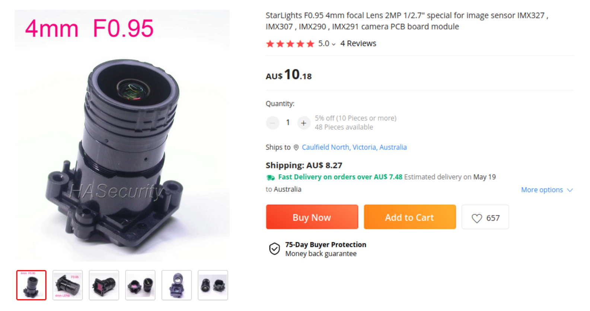

# Full RMS Setup and Run

## Description

- The title says it all
  - Skies are looking good tonight, will attempt a run of the almost-stock RMS code
  - Small modification to set gimbal to point skyward at beginning of capture

### Considerations

- I live in a big city, so this will gauge the camera's ability to see stars in a heavily light polluted area
  - Using the following lens:

## Aims & Objectives

- Aims
  - To test the following qualities of the
  - Stress test
- Objectives

## Setup

### Software Setup

- [x] Installed pyserial on RMS in the RMS conda environment
- [ ] Run `build.sh` in the root of the RMS repo
- Need to capture `.platepar` files for the desired spotting point
  - Following the SkyFit2 guide from [resources.md](../../Docs/resources.md#rms-software-setup)
    - Linked here: [SkyFit2 tutorial (updated for 2023 version)](https://www.youtube.com/watch?v=ao3J9Jf0iLQ)

### Physical Setup

- Small table for RMS to sit on
- Rain protection (just in case)

#### Connections

- Powerboard for:
  - Camera
  - Gimbal
  - Borealis
- Gimbal USB connection to Borealis
- Camera Ethernet connection to Borealis
- USB Mouse for Borealis (touchpad is broken)

### Codebase Modifications

- Before RMS capture begins:
  - Connect to gimbal
  - Set orientation to: -45° pitch, 0° roll, 0° yaw
- d

## Method

- Run with `python -m RMS.StartCapture -d 1`
