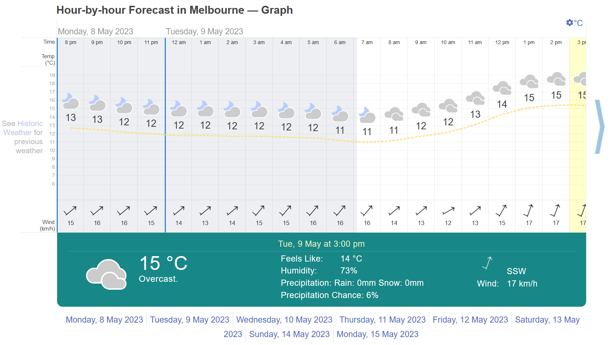
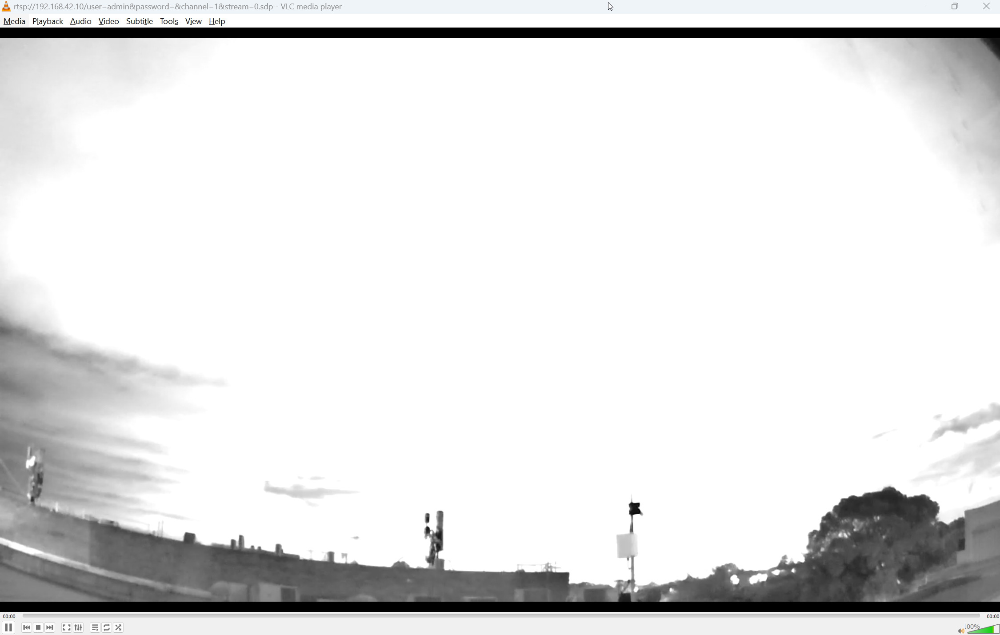
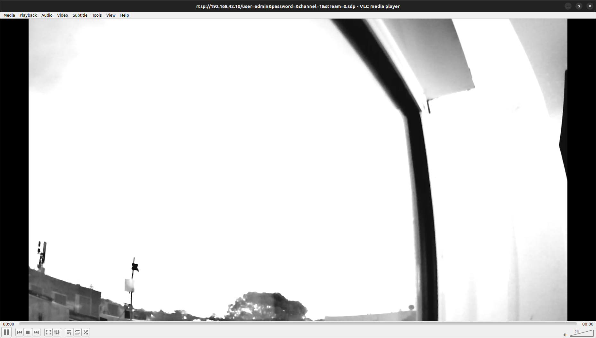
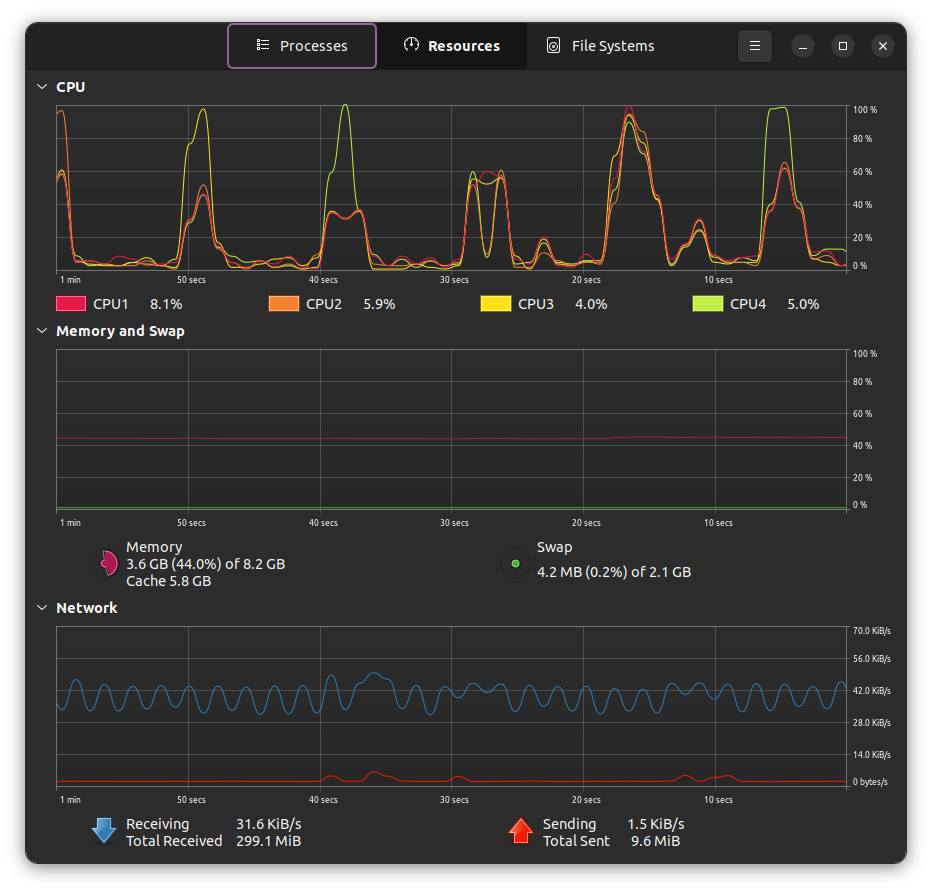

# Stock RMS Test - Take 2

## Introduction

- Previous test didn't proceed due to technical issues
- Hopefully this one won't be subject to the same fate

### Conditions

> 08/05/2023 - Approximately 8pm AEST 
> Facing West through bedroom window 
> ~8.5km (as the crow flies) from city CBD 
> 4mm lens 
> Rainy and cloudy night 
> 1.5 hour capture 

## Aims & Objectives

### Aims

- [ ] To test **Yaw drift** with 2nd IMU installed and operational
- [ ] To test Camera's night vision ability
- [ ] To test RMS as a whole (system integration test)
- [ ] To test RMS power consumption
- [ ] To collect data for later use in semi-automated testing

### Objectives

- [ ] Setup RMS facing out window
- [ ] Begin successful data capture
- [ ] Leave unattended for 1.5 hours
- [ ] Analyse resultant data

## Requirements, Specifications, Motivations and Approach

- `build.sh` previously ran
  - No changes to codebase since then, therefore no need to re-run
- Attempting run without plate parameters (`.platepar`)
  - This will affect detection accuracy (not that detection is likely in such weather)

## Method

- Setup RMS facing window
- Remove lens cap
- Install power monitoring device
- Set:
  - Pitch = 22
  - Roll = 0
  - Yaw = -20
- Power all systems
- Manually move camera into position using `stormfront` or GUI tool
- Begin capture for 1.5 hours with `python -m RMS.StartCapture -d 1.5`

> Initial capture as seen through VLC 
> Captured 8/5/2023 - 8:17PM

Begun capture at 8:21pm

## Results

- Data saved at `/home/<USER>/RMS_data/CapturedFiles/YYYYMMDD_hhmmss_uuuuuu`
- Where child directory is the datetime the recording started

### Image Gallery

> Final capture as seen through VLC 
> Captured 8/5/2023 - 9:49PM (~1.5 hours after initial capture)

> Resource usage of the RMS while operational 
> Note the periodic CPU usage spikes - likely caused by the end of the previous FFTP capture block and the start of the next one (every ~10 seconds).

### Notes

- Unable to start capture in regular terminal
  - Must start in vscode integrated terminal
  - Unsure why
  - Both terminals mounted at same point
  - Both using same conda env

## Discussion

### Yaw Drift Issue

- The yaw drift issue has not been solved by the addition of a 2nd IMU
- As the system is designed to provide long videos with the camera facing one direction, this is an issue
  - Camera motion is effectively null during ~10 second FFTP capture blocks
  - However, drift over time means camera will eventually turn away from the sky
    - And thus be unable to observe meteors

#### Solutions

Some possible solutions are:

- T-STorM32
  - An upgraded version of STorM32 that uses a better gyro communication protocol and more importantly, **encoders**
  - This means that the gimbal will be able to track its position absolutely
- OpenCV AruCo Markers
  - Markers on the camera's edge of frame
  - If the camera can see these, it indicates it has moved / is moving out of range
  - Correction could then be applied to move the camera back into place
  - Complex, but possible without changing hardware
- Magnetometer integration
  - Not supported - see [this wiki page](http://www.olliw.eu/storm32bgc-v1-wiki/STorM32_FAQ#What_about_the_magnetometer_support?)
  - Unable to add support in code, as gimbal firmware isn't open source
- 2-axis gimbal
  - No yaw axis (just pitch and roll instead)
  - Means reduced stabilisation, but can't yaw drift if you have no yaw
  - Ship rocking motion primarily front-back and side-side, yaw only affects turning

## Conclusion
