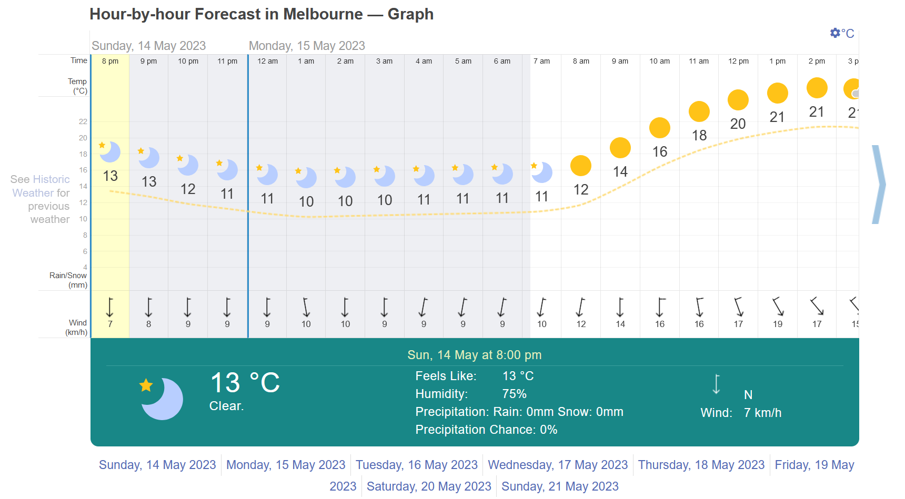
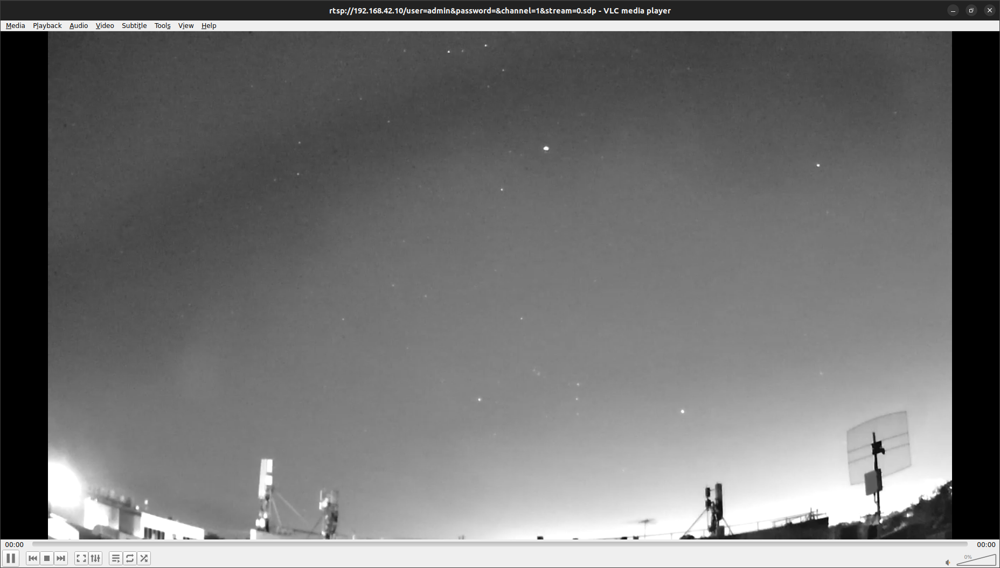
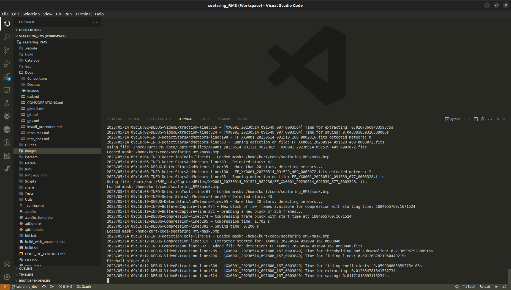
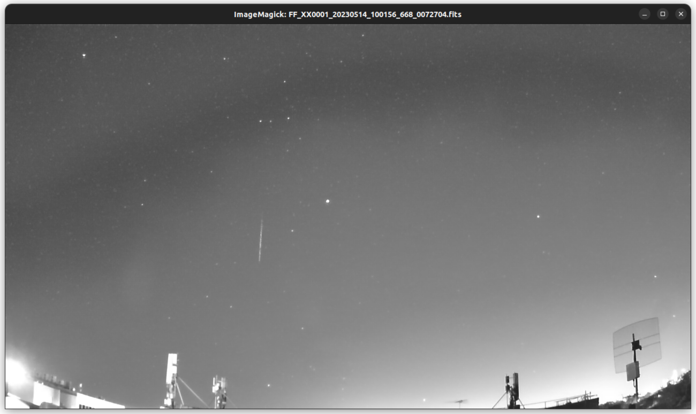

# Stock RMS Test - Take 3

## Introduction

- Previous test didn't produce exceptionally useful results
- Yaw drift issue was in effect
- This meant that the data collected was invalidated

### Conditions

> 14/05/2023 - Approximately 7:15pm AEST 
> Facing West through bedroom window 
> ~8.5km (as the crow flies) from city CBD 
> 4mm lens 
> Exceptionally clear night 
> 1.5 hour capture 

## Aims & Objectives

### Aims

- [x] To test the RMS's meteor capture ability
- [x] To capture useful meteor data to use in:
  - System overview imagery
  - Proof of concept

### Objectives

- [x] Setup RMS facing out window
- [x] Begin successful data capture
- [x] Leave unattended for 1.5 hours
- [ ] Analyse resultant data

## Requirements, Specifications, Motivations and Approach

- `build.sh` previously ran
  - No changes to codebase since then, therefore no need to re-run
- Attempting run without plate parameters (`.platepar`)
  - This will affect detection accuracy (not that detection is likely in such weather)

## Method

- [x] Disable laptop touchscreen with `sudo modprobe -r wacom`
  - This stops the broken touchscreen from randomly clicking all over the screen
- [x] Setup RMS facing window
- [x] Remove lens cap
- [x] Install power monitoring device
- [x] Disable gimbal yaw motor
  - [x] Disable in config tool (`setup -> yaw motor -> disabled`)
  - [x] Test gimbal still corrects pitch and roll
- [x] Set (using `stormfront` or the GUI tool):
  - Pitch = `-26`
  - Roll = `0`
  - Yaw = `N/A`
- [x] Power all systems
- [x] Begin capture for 1.5 hours with `python -m RMS.StartCapture -d 1.5`

> Initial capture as seen through VLC 
> Captured 2023-05-14 09:11:55 UTC (19:11:55PM AEST)

> Terminal output from the RMS capture program, running inside a terminal in Visual Studio Code 
> Note that the system has identified 43 stars in its field of view. 
> The minimum number of stars required for valid detection is 20.

Begun capture at ~7:15pm

## Results

- Data saved at `/home/<USER>/RMS_data/CapturedFiles/YYYYMMDD_hhmmss_uuuuuu`
- Where child directory is the datetime the recording started

### Image Gallery

> Final capture as seen through VLC 
> Captured 8/5/2023 - 9:49PM (~1.5 hours after initial capture)

> Stack image of a meteor found during the 1.5hr capture 
> Event string: `FF_XX0001_20230514_100156_668_0072704`

---

### Segfaulting

- Using the following utilities seems to crash Python
  - `FRbinViewer`
  - `GenerateMP4s`
  - `GenerateTimelapse`

#### Solution Work

##### Attempt 1 (using the latest changes)

- [x] Updated `seafaring_dev` branch to master
- [x] Reinstalled Python package (with `python setup.py install`)
- [x] Reprocess data using [this guide](https://github.com/markmac99/ukmon-pitools/wiki/Reprocessing-RMS-Data)
- ❌ Didn't work
  - Took ~11.3 minutes to analyse 1.5hrs of footage
  - Segfaulted on timelapse generation

##### Attempt 1.5

- Noted there was an error about wayland when running `StackFFs`
- [x] Switched to using `x.org` instead of `wayland`

##### Attempt 2 (using a plate parameters file)

Perhaps the system is crashing since it doesn't have a `.platepar` file?

- ❌ Create a plate parameters file
  - Using [this tutorial](https://github.com/markmac99/ukmon-pitools/wiki/How-to-create-a-Platepar-File)
  - And [this other tutorial](https://www.youtube.com/watch?v=ao3J9Jf0iLQ&t=30s&ab_channel=GlobalMeteorNetwork)

Note:

- Turns out that the city is so light polluted, it has invalidated the use of skyfit
- The entire bottom half of the frame has no stars visible in it
  - However, skyfit2 calibration requires that you have stars in all parts of the image
  - To account for lens distortion
- Thus the data is invalidated for use with skyfit

###### Platepars

- Creating in `~/RMS_data/calib`
- Using data from the capture that started at midnight
- Need to launch `SkyFit2` from within the RMS repository root directory

## Discussion

The obtained imagery, while not under proposed test conditions, is useful.
Data use in a test suite and proof-of-concept are both possible.

## Conclusion
