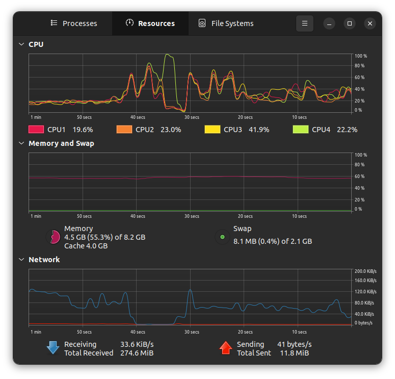

# Pipeline Testing

- Document to compare the `gstreamer` and `ffmpeg` video pipelines
- Initially started as a document to help get any pipeline working
- Connects fine on VLC so we know the cam's connected and configured all good

## Non-functional

```bash
# doesn't work
    # includes gst launch and doesn't sink video to the app I think
gst-launch-1.0 rtspsrc location="rtsp://192.168.42.10:554/user=admin&password=&channel=1&stream=0.sdp" ! rtph264depay ! h264parse ! decodebin ! autovideosink
```

## Functional

### gstreamer

```bash
# as copied from the repo README.md (added "'s to fix string)
    # ! runs fine in terminal (with gst-launch prefix)
    # ! works fine in Python too
device: rtspsrc location="rtsp://192.168.42.10:554/user=admin&password=&channel=1&stream=0.sdp" ! rtph264depay ! h264parse ! decodebin ! videoconvert ! appsink sync=1

# Paste above string in config file (replacing existing device: string)
# then run:
python -m Utils.ShowLiveStream

# Run gstreamer alone with:
gst-launch-1.0 rtspsrc location="rtsp://192.168.42.10:554/user=admin&password=&channel=1&stream=0.sdp" ! rtph264depay ! h264parse ! decodebin ! videoconvert ! autovideosink
# appsink changed to autovideosink so it pops up graphically
```

### FFmpeg

```bash
# string to launch under ffmpeg, instead of gstreamer
    # ! runs fine in both python and the terminal
device: rtsp://192.168.42.10:554/user=admin&password=&channel=1&stream=0.sdp

# Paste above string in config file (replacing existing device: string)
# then run:
python -m Utils.ShowLiveStream

# Run FFmpeg from CLI alone with:
ffplay "rtsp://192.168.42.10:554/user=admin&password=&channel=1&stream=0.sdp"
```

<figure>
    
    <figcaption>
        Screenshot of the Python `ShowLiveStream` utility.<br/>
        Picture shows the back of my laptop as viewed by the camera.
    </figcaption>
</figure>

## Notes

- FFmpeg pipeline launches faster
- FFmpeg pipeline has *significantly* less latency
  - On the order of a few seconds as versus gstreamer
- FFmpeg appears to have a more stable pipeline?
- Both pipelines do stutter every second in the Python livestream however

<figure>
    
    <figcaption>
        Screenshot of the Gnome's System Monitor utility as running on <code>Borealis</code>.<br>
        Flat CPU utilisation region proceeding ~45 second spike is during active FFmpeg usage through the python livestream utility.<br>
        Highly variable region from ~20s to rightmost side of graph is during active gstreamer usage through the python livestream utility.
    </figcaption>
</figure>
